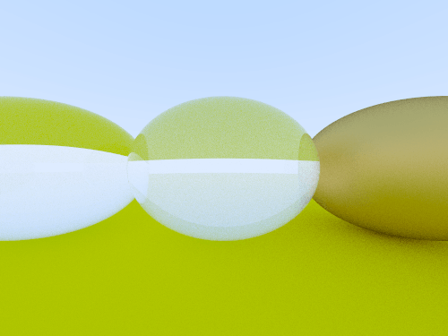
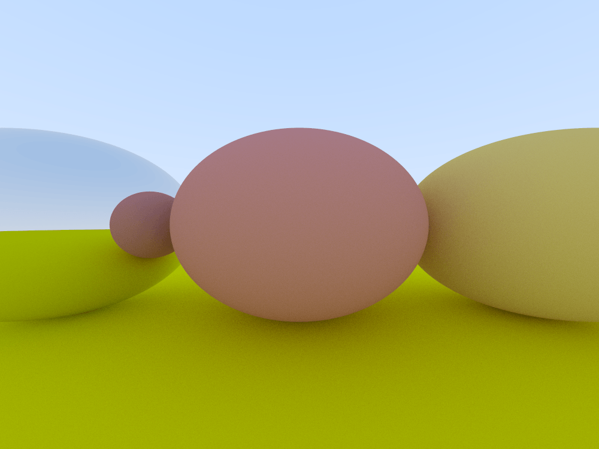

My notes for [Ray Tracing in One Weekend](https://raytracing.github.io/books/RayTracingInOneWeekend.html#outputanimage/theppmimageformat).

---

## Build

```sh
make
```

## Run

```sh
./program > [output].ppm
```

---

## Results




