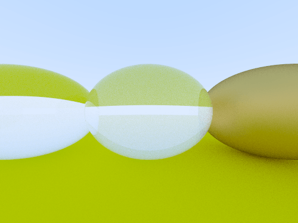
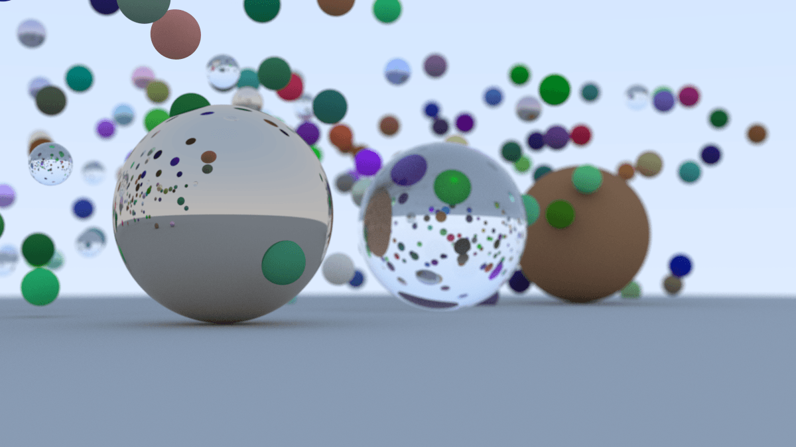
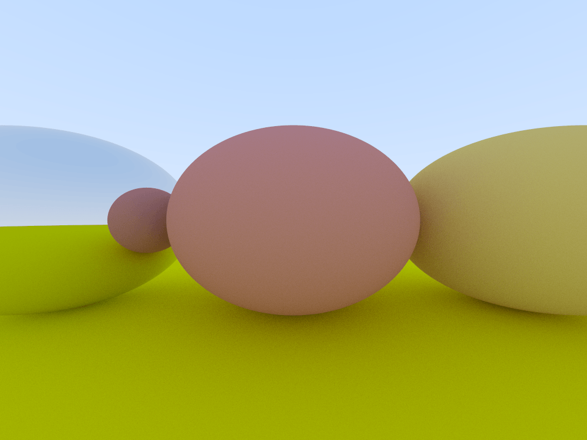

My notes for [_Ray Tracing in One Weekend_](https://raytracing.github.io/books/RayTracingInOneWeekend.html#outputanimage/theppmimageformat).

---

## Build

```sh
make
```

## Run

```sh
./program > [output].ppm
```

---

# Theory

## Surface Normal

It's a vector that is perpendicular to the surface at the point of intersection. For a sphere, the outward normal is in the direction of the hit point minus the center:


_Sphere surface-normal geometry_


_Possible directions for sphere surface-normal geometry_

## Dielectrics

Water, glass and diamonds are examples of Dielectrics. When a light ray hits them, it splits into a reflected and a refracted ray.

Refraction is described by Snell's law:

`𝜂⋅sin𝜃 = 𝜂′⋅sin𝜃′`

# Results

|||
|--|--|
|  |  |
|  |  |
